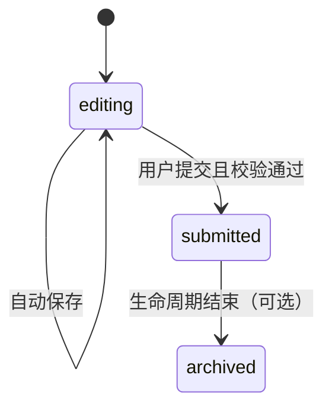

# 问卷系统设计 - 第 3 课：草稿持久化、恢复与提交流程

## 学习目标（本节结束后你能做到什么）

1. 能设计一条可靠的草稿自动保存链路，而不是只会说“定时存一下”。
2. 能解释服务端草稿、浏览器本地缓存、最终提交结果三者的职责分工。
3. 能讲清楚用户关闭系统、浏览器崩溃、断网重连后如何恢复内容。
4. 能把草稿态到提交态的状态机讲清楚，并知道关键校验应该放在哪里。

## 内容讲解（核心概念，用类比、例子、图示说清楚）

编辑锁解决的是“谁能改”，草稿持久化解决的是“改了别丢”。  
这两个问题经常被混在一起，但它们其实是两条不同的设计线。一个系统即使把锁做得很好，如果保存策略不稳，用户照样会骂你；反过来，草稿存得再勤，只要多人都能乱写，也一样会出问题。

先看数据对象。对于一份问卷实例，通常会有这些核心字段：

- `instance_id`：问卷实例 ID
- `template_version`：答题时绑定的模板版本，避免模板变更后老草稿无法解释
- `draft_content`：当前草稿内容，可以是 JSON
- `draft_version`：草稿版本号，每次保存递增
- `status`：`editing / submitted / archived`
- `updated_by`、`updated_at`
- `submitted_at`

为什么草稿内容常用 JSON 存？  
因为问卷字段往往高度动态，不同模板问题数不同、题型不同。如果把每道题都拆成关系表行当然也能做，但实现复杂度更高。对中小规模问卷系统来说，`一份问卷实例 + 一份答案 JSON + 必要索引字段`通常是更实用的起点。真正需要做统计分析时，可以异步把已提交结果抽到分析表或数仓里。

自动保存策略也不能只说“每秒存一次”。因为保存太频繁会带来两个问题：  
第一，数据库写压力上升。  
第二，网络抖动时容易堆积大量重复请求。  
更稳的做法通常是组合策略：

1. 字段失焦时保存一次。
2. 连续输入时做 debounce，比如 3 到 5 秒。
3. 页面关闭前尽量补一次保存，但不能把它当成唯一手段，因为浏览器不一定给你机会。
4. 持锁心跳和自动保存分开，不要混成一个请求，否则一个失败会同时影响锁和草稿。

服务端保存时，除了校验锁归属，还建议带`draft_version`。  
这不是为了支持多人同时编辑，而是为了避免重复请求和乱序覆盖。比如网络抖动时，版本 11 的保存先到，版本 10 的迟到请求后到；如果不比较版本，你可能把新答案又覆盖回旧答案。  
所以保存接口可以设计成：

```text
POST /questionnaires/{instanceId}/draft
{
  "sessionId": "...",
  "draftVersion": 11,
  "answers": { ... }
}
```

服务端处理逻辑：

- 先校验当前 session 是否持有编辑锁
- 再校验请求版本是否大于等于当前版本
- 合法则落库，返回最新版本号和服务端保存时间
- 非法则拒绝，并把服务端最新状态带回去

这样做的好处是，锁负责防并发写，版本号负责防乱序覆盖，两者职责清楚。

接下来讲恢复。  
“系统关闭后再打开，加载上次内容”这句话至少对应三种实际场景：

第一，用户正常关闭页面，之前自动保存都成功了。  
这种最简单，下次打开直接从数据库读最近草稿即可。

第二，用户浏览器崩溃或机器断电，最后几秒输入还没来得及发到服务端。  
这时如果系统完全没有本地兜底，最后几秒内容就会丢。更好的做法是前端额外用 IndexedDB 或 localStorage 保存一份短期本地草稿，但要注意：本地草稿只是一层补偿，不是权威数据。页面重新打开时，应先拉服务端草稿，再比较本地未同步内容是否更新。如果本地更“新”，可以提示用户“检测到本地有未同步输入，是否尝试恢复”。不要直接无脑覆盖服务端。

第三，用户换设备登录。  
这时本地缓存天然失效，所以真正可靠的恢复一定要依赖服务端草稿。

提交流程也要单独讲。很多人会把“保存”和“提交”当成同一个动作，但它们语义不同。  
保存表示草稿仍可继续修改；提交表示业务上进入最终态，通常要做更严格校验，并可能触发后续流程，比如审批、评分、归档、通知。

一个清晰的状态机可以是：



提交时要做的事情通常包括：

- 校验当前用户仍持有编辑锁
- 对必填项、格式、附件完整性做一次全量校验
- 将状态从`editing`切到`submitted`
- 记录提交人、提交时间
- 释放编辑锁
- 如有需要，异步发消息给后续系统

这里建议把“状态切换 + 最终答案落库 + 释放锁”设计成同一个事务性单元，至少在同一服务里要保证顺序正确。否则容易出现这种尴尬情况：状态已经变成已提交，但最终答案没写进去，或者答案写进去了，但锁没释放，导致别人还看到“有人正在编辑”。

再看失败恢复。  
如果保存失败，前端必须显示明确状态，比如“正在保存”“已保存于 14:32:10”“保存失败，正在重试”。用户最怕的是系统一声不吭。  
如果提交失败，也不能只弹一个泛化错误。最好区分是校验失败、锁失效、网络失败还是服务异常。尤其是锁失效时，要立即把页面降成只读，阻止继续输入。

最后给一个务实建议：  
不要一上来就设计“每次输入都保存增量 patch”。这确实更高级，但复杂度很高，要处理 patch 合并、顺序和回放。对这个题来说，直接保存整份答案 JSON，配合版本号和合理频率，通常已经足够稳定。只有问卷特别大、字段特别多、写放大明显时，再考虑增量保存。

## 小结（3-5 条关键点）

1. 编辑锁解决“谁能改”，草稿持久化解决“改了别丢”，两条设计线不能混。
2. 服务端草稿是权威状态，浏览器本地缓存只是异常场景下的恢复兜底。
3. 自动保存宜采用“失焦 + debounce + 页面退出补偿”的组合，而不是每次击键都直写数据库。
4. 锁和版本号要配合使用：锁防并发写，版本号防重复请求和乱序覆盖。
5. 提交不是一次普通保存，它意味着状态机切换、全量校验和后续流程触发。

---

## 检查站：请回答以下问题

1. 为什么只依赖浏览器本地缓存，不能满足“关闭后再打开恢复内容”的真正需求？
2. 锁已经限制了单人编辑，为什么保存接口仍然建议带 `draftVersion`？
3. 自动保存为什么不建议每次击键都直接写数据库？
4. “保存草稿”和“提交问卷”在系统语义上最大的差别是什么？
