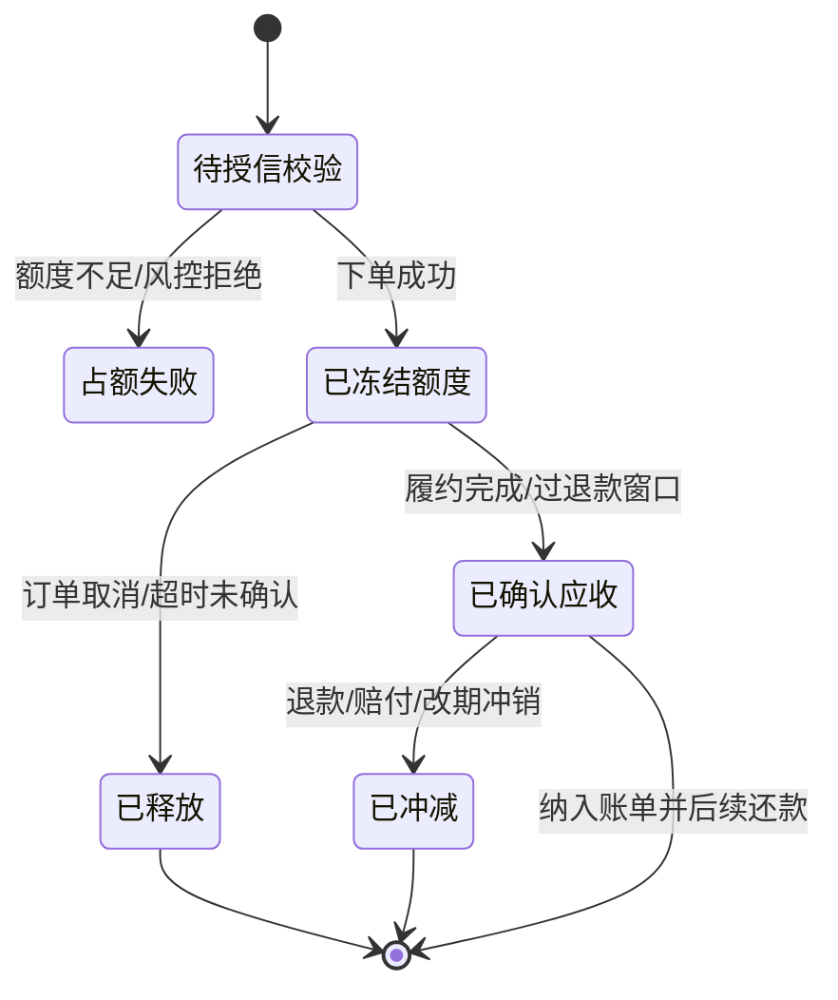

# 飞猪延期支付系统设计 - 第 2 课：授信、额度账户、账单与状态机

## 学习目标（本节结束后你能做到什么）

1. 能把延期支付系统拆成几个核心服务，而不是只会说“加个账单表”。
2. 能解释额度账户的关键字段和状态流转。
3. 能讲清订单何时占额、何时释放、何时转成应收。
4. 能说明为什么短途旅游场景更适合“周期账单聚合”，而不是每笔订单单独催款。

## 内容讲解（核心概念，用类比、例子、图示说清楚）

上一课我们把题目定义清楚了。这一课开始进入系统主体。

你可以先建立一个总观点：

**延期支付系统 = 商户准入与授信 + 订单占额 + 履约确认 + 周期出账 + 还款与逾期。**

只要这五个环节有一个没设计好，系统就会出现明显问题。  
比如只做了授信没有账单，商户不知道该还多少钱；只做了账单没有额度，商户会超买；只做了额度没有履约确认，取消退款后的账就会混乱。

### 1. 服务拆分不要太散，但也不能太糙

面试里我一般会拆成六个核心模块。

1. `商户中心`
   - 维护商户基础信息、合同、资质、历史交易概览
   - 对外提供商户维度查询

2. `授信/风控服务`
   - 负责开通审批、额度授予、账期配置、风控规则判定
   - 输出商户是否可用延期支付，以及可用额度、账期天数、适用品类等

3. `订单服务`
   - 负责交易下单
   - 下单时调用授信服务和额度服务完成校验

4. `额度账户服务`
   - 这是核心
   - 负责总额度、冻结额度、已用额度、逾期状态的管理
   - 要求并发安全，避免超额占用

5. `账单中心`
   - 负责把订单维度应收汇总成周期账单
   - 维护账单状态、到期日、已还金额、待还金额

6. `催收与通知服务`
   - 负责还款提醒、自动扣款、逾期冻结、催收任务派发

这里有一个面试表达技巧：  
不要把服务拆得像画微服务目录树一样细。  
比如“消息发送服务”“短信模板服务”“审批日志服务”这些可以作为辅助能力一笔带过，不要一开始就讲太碎。  
重点是抓住业务骨架。

### 2. 商户为什么应该是“先授信，再下单”

如果你每次下单都临时审批，会有两个问题。

第一，交易体验太差。  
旅游产品很多是实时占位或准实时确认。商户下单时如果还要走人工审批，业务会卡死。

第二，系统难以扩展。  
大量小额订单如果都逐单审核，风控和运营人力根本扛不住。

所以更合理的模式是：  
**先对商户做准入和授信，再在下单时做自动校验。**

这个授信结果一般包括：

- `credit_limit_total`：总额度
- `repayment_term_days`：账期天数，例如 T+7、T+15
- `supported_product_scope`：适用品类，比如仅门票、仅短途团，或者排除高风险产品
- `risk_level`：风险等级
- `status`：是否启用、是否冻结、是否人工复核中

### 3. 额度账户最核心的不是字段多，而是状态清楚

我通常会把额度账户压成下面几类金额。

- `total_amount`：总授信额度
- `available_amount`：可用额度
- `frozen_amount`：已冻结但尚未形成最终应收的额度
- `used_amount`：已经确认应收、等待商户还款的额度
- `overdue_amount`：已逾期未还的金额

你可以把它想成一个水箱。

- 总额度是水箱总容量
- 可用额度是还能继续装水的空间
- 冻结额度是已经预留给订单、但还没真正消耗掉的部分
- 已用额度是已经变成正式欠款的部分
- 逾期金额是已经过期还没还的钱

为什么一定要分 `frozen_amount` 和 `used_amount`？  
因为旅游订单在履约前并不稳定。

例如：

- 商户先下了一个 5000 元的团单
- 系统先冻结 5000 元额度
- 如果订单出行前取消，就直接释放冻结额度
- 如果游客核销完成，则把这 5000 从冻结转为已用

没有这层区分，你会发现取消退款场景很难处理。

### 4. 下单链路应该怎么走

下单时我会把主链路讲成下面几个步骤。

1. 订单服务收到商户下单请求
2. 校验商户是否开通延期支付
3. 校验该产品和供应商是否支持账期
4. 查询商户信用账户，判断可用额度是否足够
5. 如果足够，则原子冻结对应额度
6. 下单成功，订单进入“已确认，待履约/待核销”

这里最重要的点不是流程本身，而是第五步的“原子冻结”。  
因为一个商户可能并发下很多订单。如果两个请求同时看到可用额度都足够，然后都成功下单，就会发生超额授信。

所以额度服务通常要保证：

- 同一商户账户更新串行化，或者通过乐观锁/CAS 控制并发
- 额度冻结操作具备幂等性
- 有明确的冻结流水，方便后续释放、冲正、审计

### 5. 为什么账单不能在下单时就一次性定死

旅游场景里的一个常见误区是：

“既然订单价格已经出来了，为什么不在下单时直接记成商户欠款？”

原因在于，订单金额虽然定了，但**应收确认时点**未必到了。

更稳健的策略通常是：

- `下单成功`：只冻结额度
- `履约完成/过关键退款窗口`：确认应收
- `进入账期`：纳入账单
- `到期后`：发起还款

这背后的业务含义是：  
平台并不把“商户先占了一个资源位”直接当成“商户最终已经欠下这笔确定债务”。  
只有当服务基本完成，或者退改窗口过去，平台才把它正式纳入应收。

### 6. 账单模型为什么更适合周期聚合

对于 B 端商户，我通常更推荐“周期账单”，而不是每笔订单单独追款。

原因有三点。

第一，**符合 B 端商户的财务习惯**。  
商户更习惯按天、按周、按账期统一对账和付款，而不是平台每出一单就催一次。

第二，**降低运营和支付成本**。  
如果每天几百笔小单都单独还款，通知、扣款、对账成本都会明显变高。

第三，**更适合旅游订单的逆向处理**。  
很多订单在履约前后会有取消和改期。先在订单维度确认应收，再按账期聚合成账单，更利于对账和调整。

你可以这样设计账单：

- 账单粒度：按商户 + 账期周期聚合
- 账单内容：本周期新增应收、退款冲减、已还金额、待还金额、到期日
- 账单状态：`DRAFT`、`ISSUED`、`PARTIAL_PAID`、`PAID`、`OVERDUE`

### 7. 状态机是这类系统的骨架

做交易系统时，很多问题本质上都是状态转移问题。  
延期支付至少有三条状态线需要分开看：

1. `商户信用状态`
   - 未开通
   - 审核中
   - 已开通
   - 已冻结
   - 已关闭

2. `订单信用状态`
   - 待占额
   - 已冻结额度
   - 已确认应收
   - 已释放
   - 已冲减

3. `账单状态`
   - 待生成
   - 已出账
   - 部分还款
   - 已结清
   - 已逾期

下面这张图可以帮助你把订单维度状态看清楚：

注意一个工程上的好习惯：  
**不要让一个状态字段同时承担业务订单状态、履约状态、账单状态三种含义。**  
这类系统如果图省事只用一个总状态，后面很容易失控。

### 8. 数据模型可以怎么抽

面试里不需要把所有字段背出来，但要能讲出核心表。

- `merchant_credit_account`
  - 商户信用账户主表
  - 保存额度和状态

- `credit_grant_record`
  - 授信审批和调额记录
  - 记录额度变更原因、审批人、规则版本

- `order_credit_record`
  - 每笔订单的占额、释放、转应收、冲减流水

- `receivable_item`
  - 订单维度应收明细
  - 用于后续聚合到账单

- `receivable_bill`
  - 商户账单主表

- `repayment_record`
  - 商户还款流水、自动扣款流水

- `overdue_case`
  - 逾期案件、催收任务、外呼记录、冻结原因

这些表的重点不是名字，而是你要让面试官看到：  
你知道“账户”“流水”“明细”“账单”“审批”“逾期”是不同层次的数据。

## 小结（3-5 条关键点）

1. 延期支付系统的主体是授信、额度、应收、账单和催收五段闭环。
2. 商户更适合先做授信，再在下单时做自动校验，而不是每单人工审核。
3. 额度账户至少要分清总额、可用额、冻结额、已用额和逾期金额。
4. 旅游订单下单时通常先占额，履约完成后再确认应收，再按周期聚合出账。
5. 状态机一定要分层设计，不能把信用状态、订单状态和账单状态混成一个字段。

## 检查站：请回答以下问题

1. 为什么额度账户里要区分 `frozen_amount` 和 `used_amount`？
2. 为什么这类 B 端场景通常更适合周期账单，而不是每单单独追款？
3. 如果商户并发下单，系统如何避免超额占用额度？
4. 你会如何解释“下单成功”和“确认应收”不是同一个时点？
